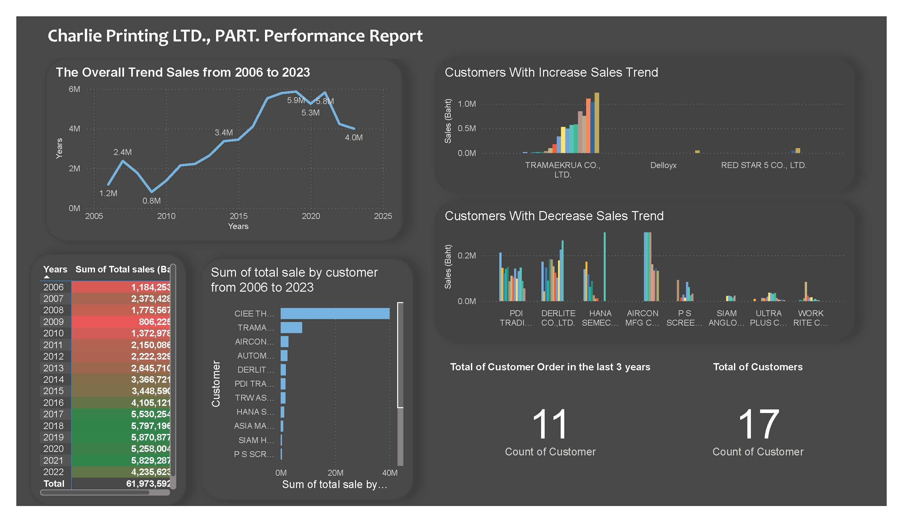

# Printing Business Analysis
**Charlie Printing LTD., PART.** is a company providing printing services, primarily generating revenue from industrial labeling product stickers. 
As advancements in data analytics have grown, the company has been maintaining raw sales data for each client which the company want to extract business insights from the data.

## The objective
To analyze the sales trends of Charlie Printing LTD., PART. from 2006 to 2023, identifying customer sales patterns and opportunities for strengthening relationships with existing and new customers.

## North Star Metric
* **Sales**: Quantity of sticker orders per year and overall.
* **Customer** Relationship: Maintaining strong relationships with recurring customers.

## Summary of Insights 
### Sales
- The overall sales trend has increased, with 2021 having the highest sales.
- From 2006 to 2013, total sales were below 3 million baht, with a slight dip in 2009.
- The top three customers by total sales value are SATYS (formerly CIEE THAILAND), TEAMAEKRUA, and AIRCON MFG., LTD.
  
### Customer Relationship
- There are a total of 15 customers who regularly order from the company; 11 of these customers have actively purchased from us in the last three years.
- Two new customers recently placed orders: Delloyx and RED STAR 5 CO., LTD.
- Six customers have ceased purchasing from the company in the past three years: HANA SEMICONDUCTOR, PDI TRADING CO., LTD, DERLITE CO., LTD., PS SCREEN CO., LTD., SIAM ANGLO CO., LTD, and WORK RITE CO., LTD.

## Recommendation and Next steps
- Relationships with the top customers remain stable, but more customers have stopped ordering compared to the number of new regular customers.
- Increase promotions targeting former customers to re-engage them with our offerings.
- Enhance marketing efforts to attract new customers.
- While there has been a slight decline in total sales since 2022, it is not a major concern as overall performance remains strong.

## Technical Process 
The technical process included:
- Cleaning and preparing the data in **Excel**
- Building a self-service dashboard for visualization in **PowerBI**
